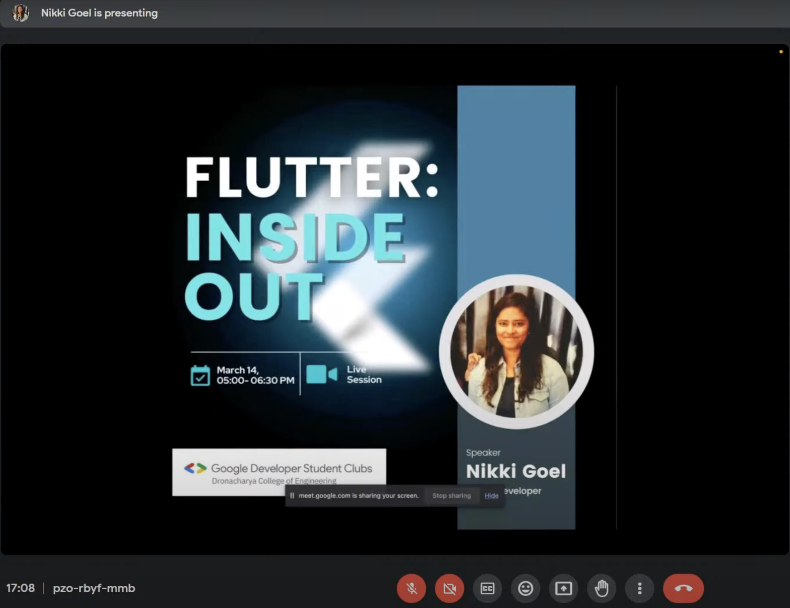
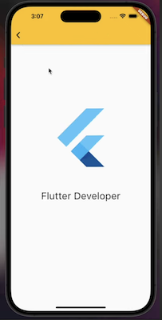

# Flutter : Inside-out

This repository contains the code for the Flutter app we built during the event, along with a PDF of the slides I presented.

# Event Recording

You can watch the recording of the event on the [YouTube](https://www.youtube.com/live/HKkZ0qbXWzI) link below.

</br>

[](https://www.youtube.com/live/HKkZ0qbXWzI)

</br>

## Slides
You can access the slides I presented during the event in the [slides](flutter_GDSC_DCE_2023.pdf) file in this repository. These slides provide an overview of Flutter development and cover the topics we discussed during the event.


## Sample Project Video
You can watch the demo of the Flutter app we built during the event in the [demo video](https://youtube.com/shorts/4FXHEZebIyc) file in this repository.

</br>

[](https://youtube.com/shorts/4FXHEZebIyc)

</br>

## Sample Project Installation
To run the app, you will need to have Flutter installed on your computer. You can then clone this repository and run the following commands:

- Switch to the source code folder

```bash
cd gdsc_dce_app
```

- Install the dependencies

```bash
flutter pub get
```

- Run the app

```bash
flutter run
```


---

You can find more information about the event on the [GDSC Community page](https://gdsc.community.dev/events/details/developer-student-clubs-dronacharya-college-of-engineering-gurugram-presents-flutter-inside-out/).

